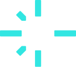
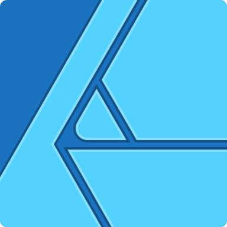
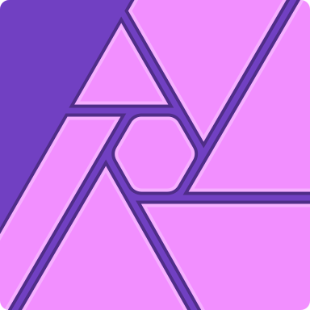
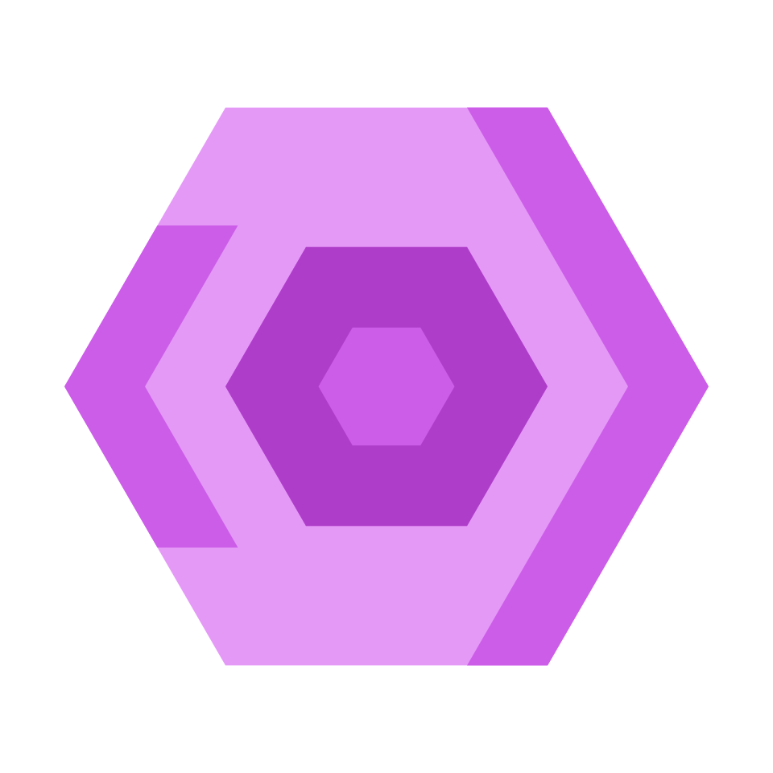

# 👾 About me
#### I am a Norwegian full-stack, game, application and web developer and designer. At this time, I am a developer apprentice at Arribatec.

 
 

# 🔡 My experience
### 👷‍♂️ Tech support intern @ Intility AS
### 👷 Production manager @ BitForge UB
### 👨‍💼 IT student @ Hamar cathedral school
### 👨‍🔬 Developer apprentice @ Arribatec Norway AS

 
 

# 💻 My go-to techs

### Native app development

 

### Frontend and web development

 

### Backend development

 

### Automation and deployment

 

### Branding and UI

 

### Developer tools

