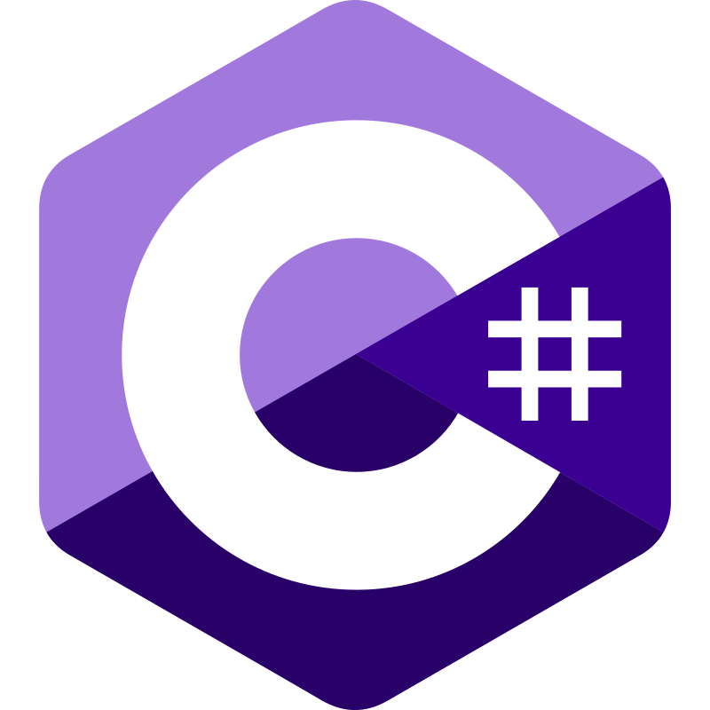
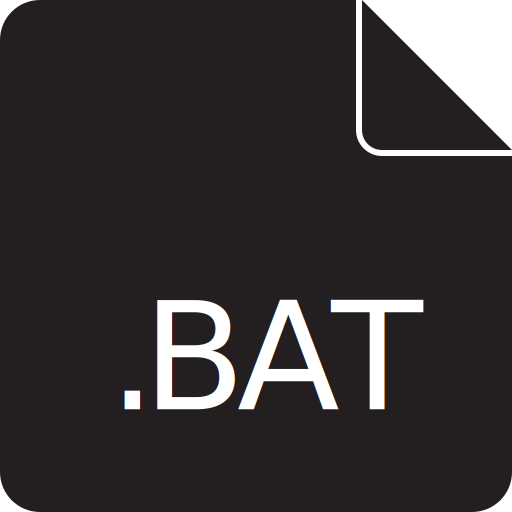
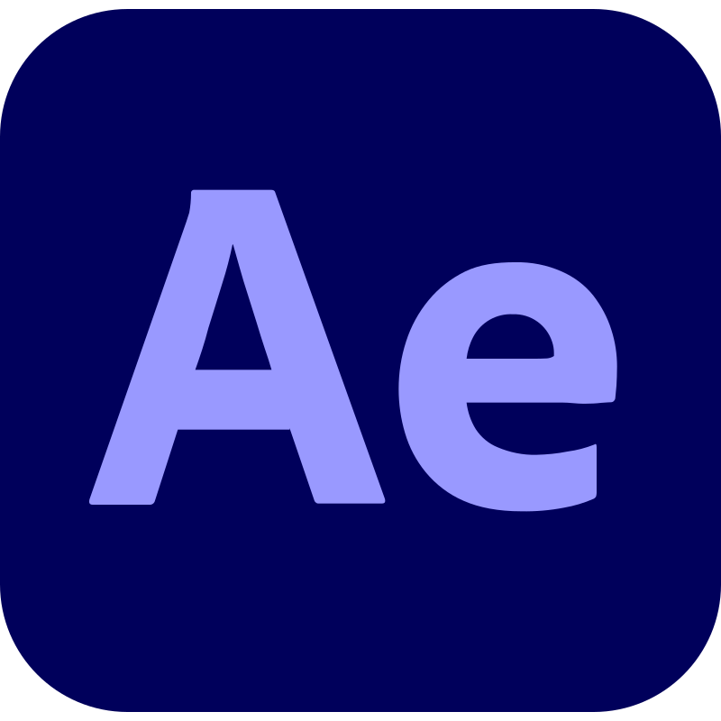

## 👾 ABOUT ME:
#### I am a Norwegian full-stack, game, application and web developer and designer. Currently I work from home, but I am a soon-to-be apprentice.
#### Previously, I was a student at Hamar cathedral school, where I followed the IT line of education. I was also the production manager at our youth company BitForge UB at the same school.

 

## 🔡 MY EXPERIENCE:
### 👷‍♂️ Tech support intern @ Intility AS
#### &nbsp; &nbsp; &nbsp;🗺️ Oslo, 0191
#### &nbsp; &nbsp; &nbsp;📅 November, 2023 - April, 2024  
### 👷 Production manager @ BitForge UB
#### &nbsp; &nbsp; &nbsp;🗺️ Hamar, 2315
#### &nbsp; &nbsp; &nbsp;📅 November, 2023 - June, 2024  
### 👨‍💼 IT student @ Hamar cathedral school
#### &nbsp; &nbsp; &nbsp;🗺️ Hamar, 2315
#### &nbsp; &nbsp; &nbsp;📅 August, 2022 - June, 2024

 

## ⌨️ LANGUAGES I USE:

    
    
    
    
    
    
    
    
    
    
    
    

 

## 🖥️ TECHNOLOGIES I USE:

    
    
    
    
    
    
    
    
    
    
    
    
    
    
    
    

